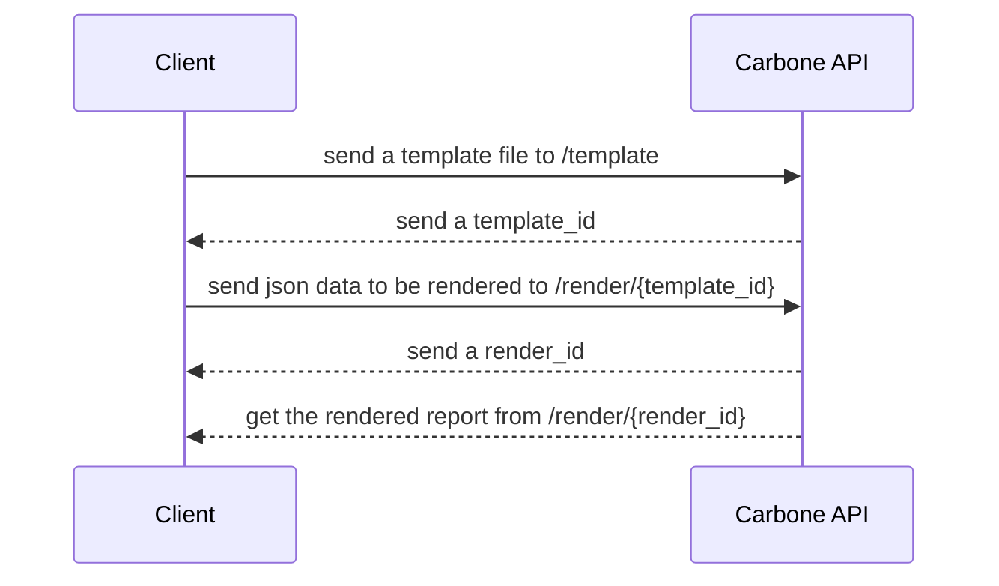

# carbone_sdk_rs

carbone_sdk_rs is a Library which supply functionalites to communicate with the [Carbone API](https://carbone.io/api-reference.html).

# Process to render a new report

# Installation

TODO

# Render a report

TODO

# References

[Carbone.io](https://carbone.io) a report generator.

## Useful links

- [How to build a template file](https://carbone.io/documentation.html#building-a-template)

- [Substitutions](https://carbone.io/documentation.html#substitutions)

- [Repetitions](https://carbone.io/documentation.html#repetitions)

- [Formatters](https://carbone.io/documentation.html#formatters)

- [Translations](https://carbone.io/documentation.html#translations)
