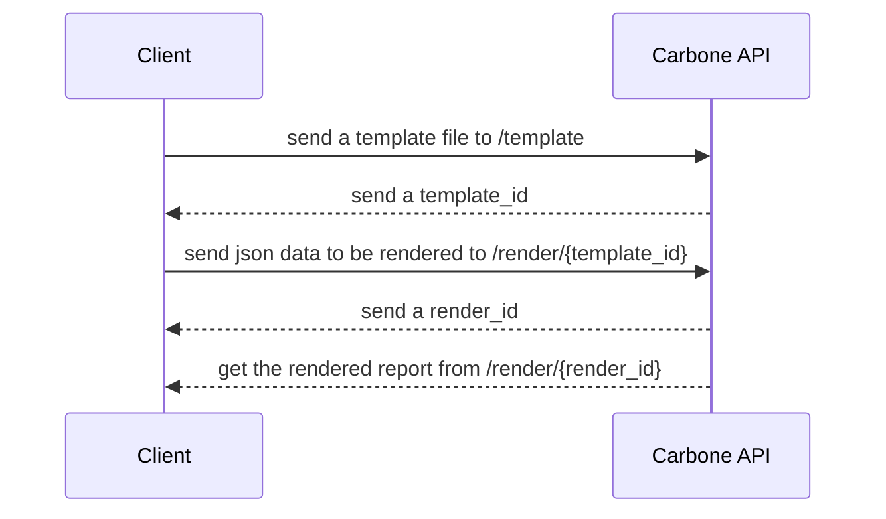

[](https://opensource.org/licenses/MIT)
[](https://github.com/pascal-chenevas/carbone_sdk_rs/actions/workflows/rust.yml)
[](https://codecov.io/gh/pascal-chenevas/carbone_sdk_rs)
[](http://github.com/badges/stability-badges)

# carbone_sdk_rs

carbone_sdk_rs is a Library that supplies functionalities to communicate with the [Carbone API](https://carbone.io/api-reference.html).

# State of development

This repo is not maintained anymore.
The project has been moved to: https://github.com/carboneio/carbone-sdk-rust

----

This Library is in the early stage of active development and doesn't reach the status of a stable release.
Therefore it can not be used in a production environment.

# Process to render a new report



# Installation

TODO

# Render a new report

### Using an existing Template

```rust
use std::env;
 
use carbone_sdk_rs::config::Config;
use carbone_sdk_rs::carbone::Carbone;
use carbone_sdk_rs::types::{ApiJsonToken, JsonData};
use carbone_sdk_rs::template::TemplateId;
 
use carbone_sdk_rs::errors::CarboneError;

#[tokio::main]
async fn main() -> Result<(), CarboneError> {
    
     let token =  match env::var("CARBONE_TOKEN") {
             Ok(v) => v,
             Err(e) => panic!("{}", e.to_string())
     };
 
    let config: Config = Default::default();
 
    let api_token = ApiJsonToken::new(token)?;

    let json_data_value = String::from(r#"
         "data" : {
             "firstname" : "John",
             "lastname" : "Wick"
        },
        "convertTo" : "odt"
    "#);
 
    let json_data = JsonData::new(json_data_value)?;

    let template_id = TemplateId::new("0545253258577a632a99065f0572720225f5165cc43db9515e9cef0e17b40114".to_string())?;

    let carbone = Carbone::new(&config, &api_token)?;
    
    let _report_content = carbone.generate_report_with_template_id(template_id, json_data).await?;

    Ok(())
}
```

# References

[Carbone.io](https://carbone.io) a report generator.

[Carbone CLI App](https://github.com/pascal-chenevas/carbone_cli_rs) a simple CLI App to create reports.

## Useful links

- [How to build a template file](https://carbone.io/documentation.html#building-a-template)
